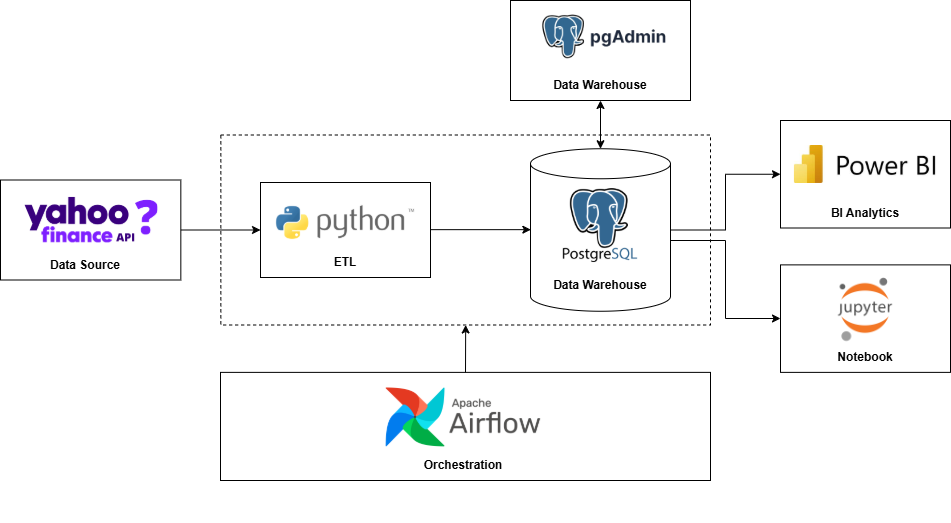

# Stock Price Data Warehouse Platform

## Overview
This project demonstrates an end-to-end data engineering platform for
stock market data using Apache Airflow, CeleryExecutor, PostgreSQL, and Docker.

## ETL Pipeline Architecture


## Data Warehouse Design
<!--  -->

## Data Pipelines
- Raw ingestion from stock market APIs
- Transformation into dimensional model
- Data quality validation
- Analytics-ready warehouse

## Tech Stack
- Apache Airflow 3.x (CeleryExecutor)
- PostgreSQL & PgAdmin
- Docker & Docker Compose
- GreatExpectation
- Jupyter Notebook

## How to Run
```bash
docker-compose up -d
bash
```


## Author
**Jumponpatha Chaimongkonrojna**
Data Engineer | AI Engineer (Data Infrastructure)